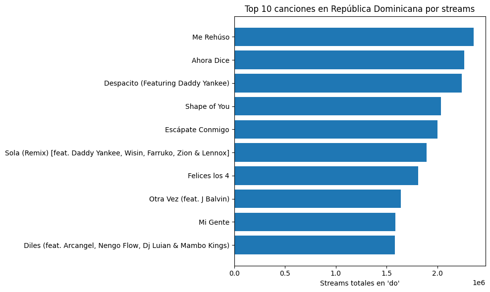
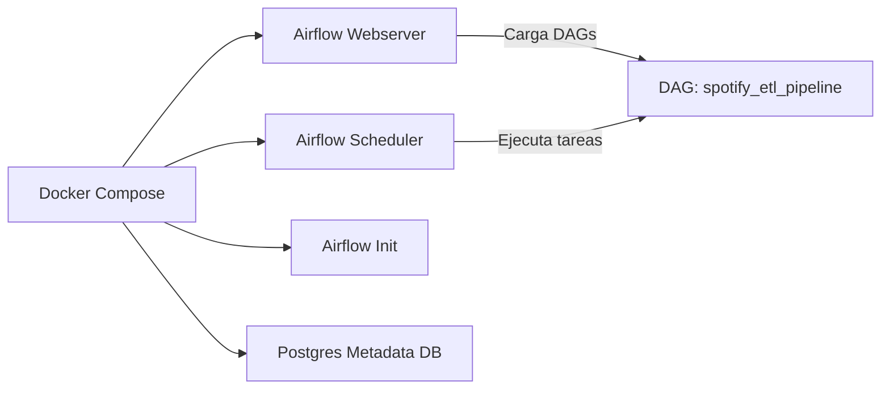
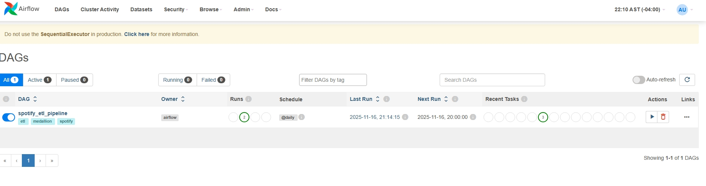
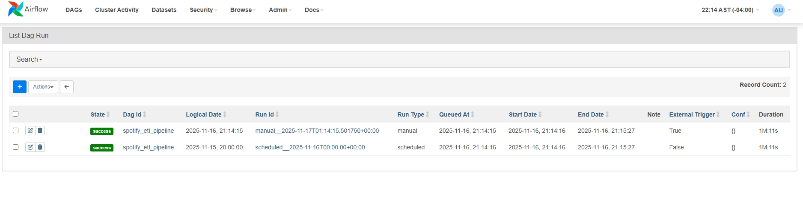
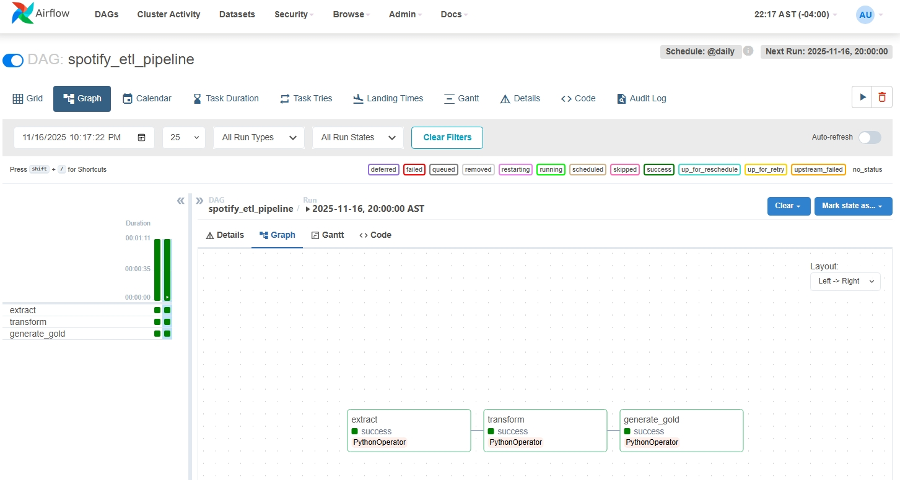

# 🎵 Spotify ETL Pipeline — Airflow + Docker + Python + Polars

## 📋 Descripción General

Este proyecto implementa un **pipeline ETL end-to-end** sobre el dataset de los **rankings diarios de Spotify a nivel mundial**, siguiendo la arquitectura **Medallion (Bronze → Silver → Gold)** y orquestado con **Apache Airflow + Docker**.

El pipeline transforma datos crudos de Spotify (top 200 canciones diarias por país) en tablas analíticas listas para responder preguntas de negocio sobre **consistencia en el ranking**, **streams por país** y **tendencias en el tiempo**.

---

## 🎯 Objetivo del Proyecto

Construir un pipeline ETL profesional que:

- ✅ Extraiga datos desde el dataset de Spotify Daily Charts
- ✅ Realice transformaciones eficientes usando **Polars**
- ✅ Genere outputs limpios en formato Parquet (Bronze → Silver → Gold)
- ✅ Sea orquestado y monitoreado con **Apache Airflow**
- ✅ Siga prácticas reales de ingeniería de datos: modularidad, reproducibilidad y escalabilidad

---

## 🧰 Tech Stack

- **Apache Airflow** — Orquestación de pipelines
- **Docker / Docker Compose** — Contenedorización y despliegue
- **Python 3.x** — Lenguaje principal
- **Polars** — Transformaciones rápidas y eficientes de datos
- **Postgres** — Base de metadatos para Airflow
- **Parquet** — Formato de almacenamiento columnar optimizado

---

## 🏗️ Arquitectura Medallion

### 🥉 Bronze — Datos Crudos

**Fuente:** [Spotify's Worldwide Daily Song Ranking - Kaggle](https://www.kaggle.com/datasets/edumucelli/spotifys-worldwide-daily-song-ranking)  
**Formato:** CSV tal como viene de Kaggle

**Columnas principales:**
- Position
- Track Name
- Artist
- Streams
- URL
- Date
- Region

La capa Bronze almacena la verdad "como viene" sin transformaciones.

---

### 🥈 Silver — Datos Limpios y Consistentes

**Transformaciones aplicadas:**

1. **Renombrado de columnas a snake_case:**
   - `Position` → `position`
   - `Track Name` → `track_name`
   - `Artist` → `artist`
   - `Streams` → `streams`
   - `URL` → `url`
   - `Date` → `date`
   - `Region` → `region`

2. **Conversión de tipos:**
   - `date` → Date
   - `streams` → Int64
   - `position` → Int64

3. **Normalización:**
   - `region` en minúsculas

**Salida:** `data/silver/spotify_daily_silver.parquet`

---

### 🥇 Gold — Tablas Analíticas

A partir de Silver se construyen **3 tablas Gold** listas para análisis:

#### 1. Canciones Más Consistentes en el Ranking

**Agrupación:** `track_name`, `artist`

**Métricas:**
- `days_in_chart`: cantidad de días que la canción aparece en el ranking
- `avg_position`: posición promedio

**Responde:** ¿Cuáles canciones se mantuvieron más tiempo en el Top 200?

---

#### 2. Streams Totales por País y Canción

**Agrupación:** `region`, `track_name`, `artist`

**Métricas:**
- `total_streams`
- `days_in_chart`
- `avg_daily_streams`

**Responde:** ¿En qué países se escucha más cada canción?

---

#### 3. Tendencia Global Diaria de Streams

**Agrupación:** `date`

**Métrica:**
- `total_streams_global`

**Responde:** ¿Cómo se comportan los streams globales a lo largo del tiempo?

---

**Archivos resultantes:**
```
data/gold/gold_consistent_songs.parquet
data/gold/gold_streams_by_country.parquet
data/gold/gold_daily_trends.parquet
```

---

## 📊 Visualizaciones y Hallazgos

### 🎧 1. Top 10 Canciones en República Dominicana



**Insights:**
- "Me Rehúso" es la canción más consumida en RD dentro del período analizado
- Reggaetón y música urbana dominan fuertemente el mercado dominicano
- Canciones globales como "Shape of You" aparecen, pero con menos fuerza relativa
- Refleja una preferencia clara por música latina, colaboraciones y ritmos urbanos


---

### 📈 2. Tendencia Diaria de Streams Globales


**Insights:**
- Tendencia ascendente desde enero hasta diciembre
- Patrones semanales muy claros (picos en fines de semana y lanzamientos)
- Caídas puntuales que representan huecos en el dataset o variaciones en cobertura
- Pico notable al final del año asociado a Navidad/Año Nuevo

---

### 🏆 3. Top 15 Canciones Más Consistentes


**Insights:**
- "Shape of You" domina como la canción más estable del año
- Pop internacional lidera la permanencia en el ranking
- "Ed Sheeran" aparece varias veces entre las canciones más consistentes
- "Despacito" figura muy alto, reflejando su boom global en 2017

---

### 🌍 4. Top 10 Regiones por Streams Totales


**Insights:**
- El ranking "global" tiene el mayor volumen (suma todas las regiones)
- US es el país con más streams individuales
- Reino Unido, Brasil, México, Alemania y España aparecen entre los países con mayor volumen de streams
- En la capa Silver se normalizan los códigos de país (gb, br, mx, de, es) a nombres completos para facilitar la lectura

---

## 🧱 Arquitectura Técnica



---

## 📂 Estructura del Proyecto

```
spotify_etl_project/
├── src/
│   ├── config.py              # Rutas y configuración general
│   ├── extract.py             # Lógica Bronze: lectura de CSV crudo
│   ├── transform.py           # Lógica Silver: limpieza + tipificación
│   └── load.py                # Lógica Gold: agregaciones y métricas
├── data/
│   ├── bronze/                # Datos crudos (Kaggle)
│   ├── silver/                # Datos limpios y tipados
│   └── gold/                  # Tablas analíticas finales
├── notebooks/
│   └── exploracion_inicial.ipynb
├── dags/                      # DAGs de Airflow
├── docker/                    # Configuración Docker/Airflow
├── assets/
│   └── Screenshots/           # Capturas del proyecto
├── images/                    # Visualizaciones generadas
├── requirements.txt
└── README.md
```

---

## ▶️ Cómo Ejecutar el Proyecto

### 1. Clonar el Repositorio

```bash
git clone https://github.com/ericksootano/spotify-etl-airflow-docker
cd spotify-etl-airflow-docker
```

### 2. Construir y Ejecutar Contenedores

```bash
docker-compose up --build
```

### 3. Acceder a la UI de Airflow

- **URL:** [http://localhost:8080](http://localhost:8080)
- **User:** `airflow`
- **Password:** `airflow`

---

## 📸 Capturas del Proyecto

### DAG Cargado Correctamente en Airflow



### Interfaz Web de Airflow



### Vista Graph del Pipeline



---

## 🗺️ Roadmap del Proyecto

### ✅ Fase 1 — Infraestructura Base (Completada)

- Configuración de Airflow con Docker Compose
- Servicios de Webserver, Scheduler, Init y Postgres
- Integración del entorno Python + Polars
- Primer DAG cargado en Airflow
- Ejecución exitosa del pipeline base

### ✅ Fase 2 — Extracción y Transformación (Completada)

- Transformaciones con Polars
- Validación de dependencias en Airflow

### ✅ Fase 3 — Almacenamiento y Medallion Architecture (Completada)

- Guardar datos en formato Parquet
- Capas Bronze → Silver → Gold

### 🔄 Fase 4 — CI/CD con GitHub Actions (En Progreso)

- Validar Docker builds en cada push
- Comandos automáticos (`airflow dags list`, linters, tests)
- Integración de badges al README

### ⬜ Fase 5 — Documentación + Portafolio

- Case study completo
- Diagrama final de arquitectura
- Publicación profesional en LinkedIn / Medium

---

## 📄 Licencia

Este proyecto utiliza licencia MIT. Ver archivo **LICENSE** incluido en el repositorio.

---

## 👤 Autor

**Erickson Otaño**  
Data Engineer  
[LinkedIn](https://linkedin.com/in/erickson-otaño)

---

## 🔗 Enlaces Útiles

- [Repositorio en GitHub](https://github.com/ericksootano/spotify-etl-airflow-docker)
- [Dataset en Kaggle - Spotify's Worldwide Daily Song Ranking](https://www.kaggle.com/datasets/edumucelli/spotifys-worldwide-daily-song-ranking)
- [Apache Airflow Documentation](https://airflow.apache.org/docs/)
- [Polars Documentation](https://pola-rs.github.io/polars/)
