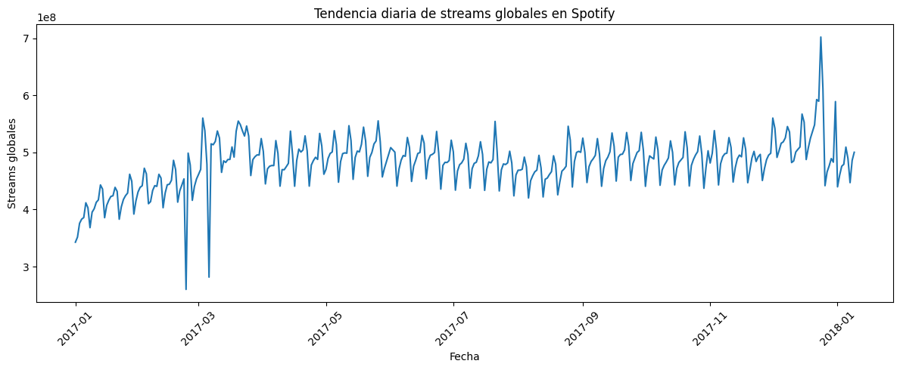
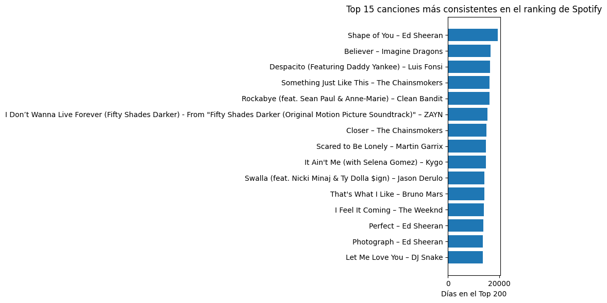

# 🎵 Spotify ETL Pipeline — Airflow + Docker + Python + Polars

Este proyecto implementa un pipeline **ETL** sobre el dataset de los **rankings diarios de Spotify a nivel mundial**, siguiendo la arquitectura **Medallion (Bronze → Silver → Gold)** y orquestado con **Airflow + Docker**.

Se desarrolla mediante un enfoque por fases, aplicando prácticas reales de ingeniería de datos: modularidad, reproducibilidad y escalabilidad.

## 🚀 Objetivo del Proyecto  
Pasar de datos crudos de Spotify (top 200 canciones diarias por país) a tablas analíticas listas para responder preguntas de negocio sobre **consistencia en el ranking**, **streams por país** y **tendencias en el tiempo**.


---

Construir un pipeline ETL end-to-end que:

- Extraiga datos desde la API de Spotify  
- Realice transformaciones eficientes usando **Polars**  
- Genere outputs limpios en formato Parquet/CSV (Bronze → Silver → Gold)  
- Sea orquestado y monitoreado con Airflow  
- Evolucione hacia un entorno profesional con CI/CD y mejores prácticas

---

## 🧱 Arquitectura (Fase 1)

```mermaid
flowchart LR
    A[Docker Compose] --> B[Airflow Webserver]
    A --> C[Airflow Scheduler]
    A --> D[Airflow Init]
    A --> E[Postgres Metadata DB]

    B -->|Carga DAGs| F[DAG: spotify_etl_pipeline]
    C -->|Ejecuta tareas| F
````


---


## 📂 Arquitectura del Proyecto

Estructura principal del proyecto:

`````````
spotify_etl_project/
├─ src/
│  ├─ config.py              # Rutas y configuración general
│  ├─ extract.py             # Lógica Bronze: lectura de CSV crudo
│  ├─ transform.py           # Lógica Silver: limpieza + tipificación
│  └─ load.py                # Lógica Gold: agregaciones y métricas
├─ data/
│  ├─ bronze/                # Datos crudos (Kaggle)
│  ├─ silver/                # Datos limpios y tipados
│  └─ gold/                  # Tablas analíticas finales
├─ notebooks/
│  └─ exploracion_inicial.ipynb
├─ dags/                     # (Próximo paso) DAGs de Airflow
├─ docker/                   # (Próximo paso) Configuración Docker/Airflow
├─ requirements.txt
└─ README.md

`````````


## 🏗️ Arquitectura Medallion
### 🥉 Bronze – Datos crudos

Fuente: dataset de Spotify Daily Charts (Top 200 por país y día).

Formato: CSV tal como viene de Kaggle.

Columnas principales:
`````````

Position

Track Name

Artist

Streams

URL

Date

Region
`````````
Bronze se limita a almacenar la verdad “como viene” sin transformaciones.


### 🥈 Silver – Datos limpios y consistentes

En la capa Silver se aplica:

Renombrado de columnas a snake_case:
`````````
Position → position

Track Name → track_name

Artist → artist

Streams → streams

URL → url

Date → date

Region → region
`````````
Conversión de tipos:
`````````
date → Date

streams → Int64

position → Int64
`````````
Normalización:
`````````
region en minúsculas.
`````````
Salida principal:
`````````
data/silver/spotify_daily_silver.parquet
`````````

### 🥇 Gold – Tablas analíticas

A partir de Silver se construyen 3 tablas Gold:

Canciones más consistentes en el ranking

Agrupación por track_name y artist.

#### Métricas:
`````````
days_in_chart: cantidad de días que la canción aparece en el ranking.

avg_position: posición promedio.
`````````
#### Responde:
`````````
¿Cuáles canciones se mantuvieron más tiempo en el Top 200?

Streams totales por país y canción

Agrupación por region, track_name, artist.
`````````
#### Métricas:
`````````
total_streams

days_in_chart

avg_daily_streams
`````````
#### Responde:
`````````
¿En qué países se escucha más cada canción?

Tendencia global diaria de streams

Agrupación por date.
`````````
#### Métrica:
`````````
total_streams_global
`````````
#### Responde:
`````````
¿Cómo se comportan los streams globales a lo largo del tiempo?
`````````
#### Archivos resultantes:
`````````
data/gold/gold_consistent_songs.parquet

data/gold/gold_streams_by_country.parquet

data/gold/gold_daily_trends.parquet
`````````
## 📊 Visualizaciones y Hallazgos

A partir de las tablas Gold se generan 3 visualizaciones principales usando matplotlib.

### 🎧 1. Top 10 canciones en República Dominicana

#### Insights:

“Me Rehúso” es la canción más consumida en RD dentro del período analizado.

Reggaetón y música urbana dominan fuertemente el mercado dominicano.

Canciones globales como Shape of You aparecen, pero con menos fuerza relativa.

Refleja una preferencia clara por música latina, colaboraciones y ritmos urbanos.

## 📈 2. Tendencia diaria de streams globales

Gráfico de línea con la evolución de los streams globales por fecha.
`````````
Eje X: date

Eje Y: total_streams_global
`````````
#### Insights:

- Tendencia ascendente desde enero hasta diciembre.

- Patrones semanales muy claros (picos en fines de semana y lanzamientos).

- Caídas puntuales que representan huecos en el dataset o variaciones en cobertura.

- Pico notable al final del año asociado a Navidad/Año Nuevo.



### 🏆 3. Top 15 canciones más consistentes

Gráfico de barras horizontal con las 15 canciones que más días aparecen en el ranking.
`````````
Eje X: days_in_chart

Eje Y: track_name – artist
`````````
#### Insights:

- "Shape of You" domina como la canción más estable del año.

- Pop internacional lidera la permanencia en el ranking.

- "Ed Sheeran" aparece varias veces entre las canciones más consistentes.

- “Despacito” figura muy alto, reflejando su boom global en 2017.



## 4. Top 10 regiones por streams totales

Gráfico de barras con las 10 regiones que más aportan streams totales.
`````````
Eje X: region

Eje Y: total_streams_region
`````````
#### Insight:

- El ranking “global” tiene el mayor volumen (suma todas las regiones).

- US es el país con más streams individuales.

- Reino Unido, Brasil, México, Alemania y España aparecen como algunos de los países con mayor volumen de streams. En el dataset originalmente venían como códigos (gb, br, mx, de, es), pero en la capa Silver se normalizan a nombres de país para facilitar la lectura por parte de usuarios de negocio.


---


## 🗺️ Roadmap del Proyecto

### ✔️ **Fase 1 — Infraestructura Base (completada)**

* Configuración de Airflow con Docker Compose
* Servicios de Webserver, Scheduler, Init y Postgres
* Integración del entorno Python + Polars
* Primer DAG cargado en Airflow
* Ejecución exitosa del pipeline base

---

### 🔄 **Fase 2 — Extracción y Transformación (completada)**

* Transformaciones con Polars
* Validación de dependencias en Airflow

---

### ⬜ **Fase 3 — Almacenamiento y Medallion Architecture (completada)**

* Guardar datos en formato Parquet
* Capas Bronze → Silver → Gold

---

### ⬜ **Fase 4 — CI/CD con GitHub Actions (en progreso)**

* Validar Docker builds en cada push
* Comandos automáticos (`airflow dags list`, linters, tests)
* Integración de badges al README

---

### ⬜ **Fase 5 — Documentación + Portafolio**

* Case study completo
* Diagrama final de arquitectura
* Publicación profesional en LinkedIn / Medium

---

## 🧰 Tech Stack

* **Apache Airflow** – Orquestación
* **Docker / Docker Compose** – Contenedorización
* **Python 3.x**
* **Polars** – Transformaciones rápidas y eficientes
* **Requests** – Consumo de APIs
* **Postgres** – Base de metadatos para Airflow

---

## ▶️ Cómo ejecutar el proyecto

### 1. Clonar el repositorio

`````````bash
git clone https://github.com/ericksootano/spotify-etl-airflow-docker
cd spotify-etl-airflow-docker 
`````````


### 2. Construir y ejecutar contenedores

`````````bash
docker-compose up --build
`````````


### 3. Acceder a la UI de Airflow

* **URL:** [http://localhost:8080](http://localhost:8080)
* **User:** airflow
* **Password:** airflow
---

## 📸 Capturas del Proyecto

### DAG cargado correctamente en Airflow


### Interfaz Web de Airflow


### Vista Graph del Pipeline


---

## 📄 Licencia

Este proyecto utiliza licencia MIT.
Ver archivo **LICENSE** incluido en el repositorio.

---

## 👤 Autor

**Erickson Otaño**
Data Engineer - [Visita mi perfil de LinkedIn](https://linkedin.com/in/erickson-otaño)````